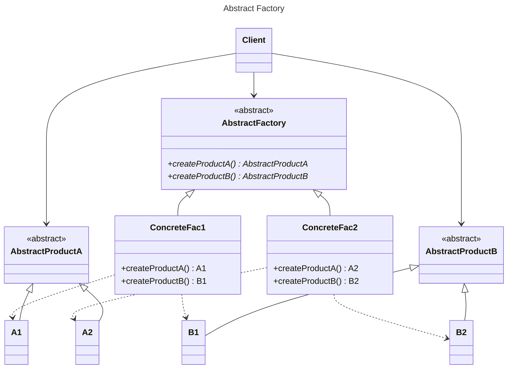
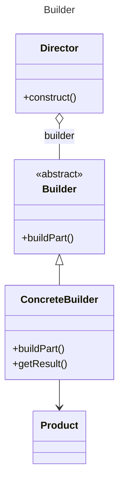
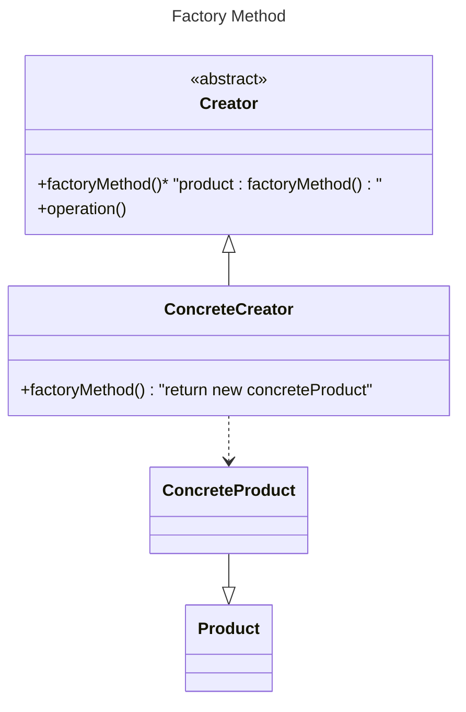
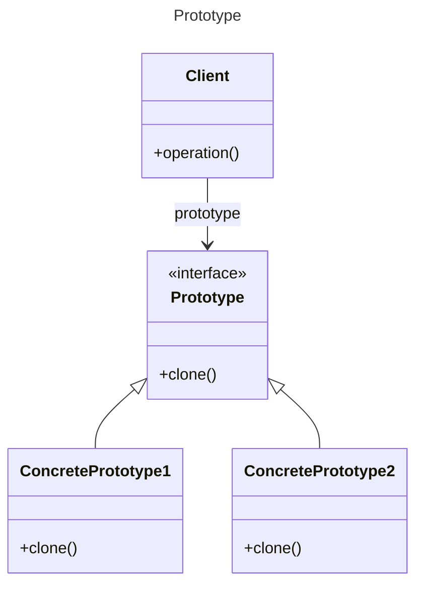
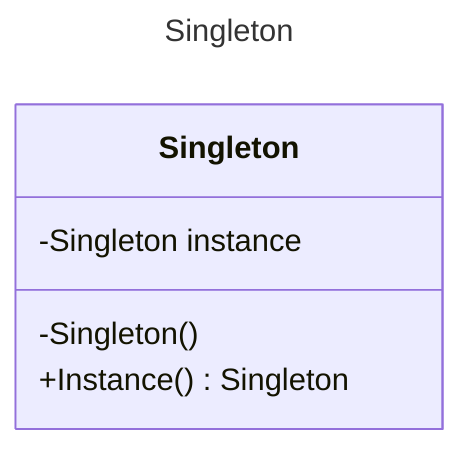
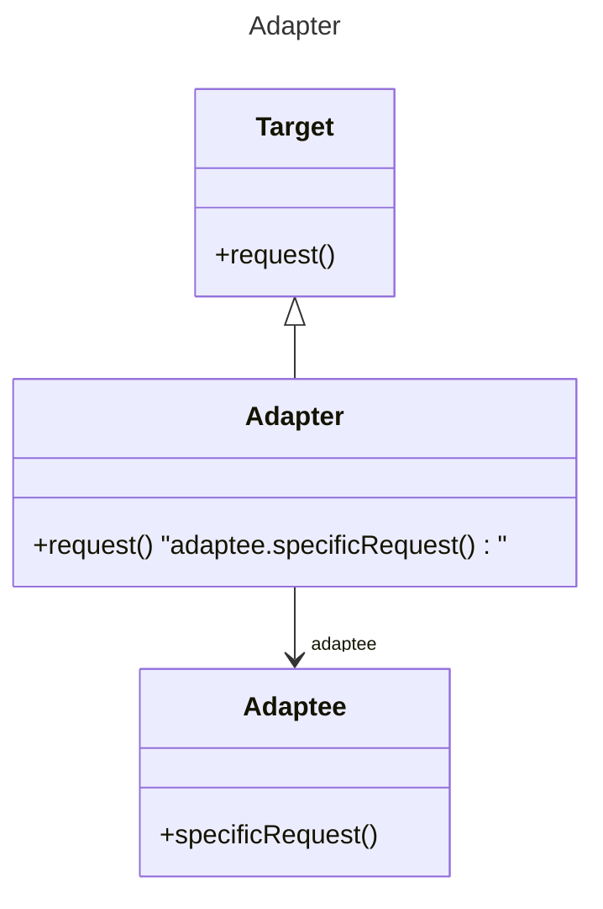

# Java-Design-Patterns
Design Patterns in Java.

## 1. Creational Patterns.
Creational design patterns are used to design the instantiation process of objects.

### 1. Abstract Factory
create a family of related objects without specifying their concrete classes.

### 2. Builder
separate object construction from its representation.

### 3. Factory Method
create an instance of several derived methods.

### 4. Prototype
a fully initialized object is copied into another object.

### 5. Singleton
ensure a class has only one instance, and provide a global point of access to it.

## 2. Structural Patterns.
Structural patterns are concerned with how classes and objects are composed to form larger structures.

### 1. Adapter
match interface of different classes.

### 2. Bridge
### 3. Composite
### 4. Decorator
### 5. Facade
### 6. Flyweight
### 7. Proxy

## 3. Behavioral Patterns.
Behavioral patterns are concerned with algorithms and the assignment of responsibilities between objects.
Behavioral object patterns use object composition rather than inheritance.

### 1. Chain of Responsibility
### 2. Command
### 3. Interpreter
### 4. Iterator
### 5. Mediator
### 6. Memento
### 7. Observer
### 8. State
### 9. Strategy