# Java-Design-Patterns
Design Patterns in Java.


## 1. Creational Patterns.
Creational design patterns are used to design the instantiation process of objects.

### 1. Abstract Factory (Factory of Factories)
create a family of related objects without specifying their concrete classes.
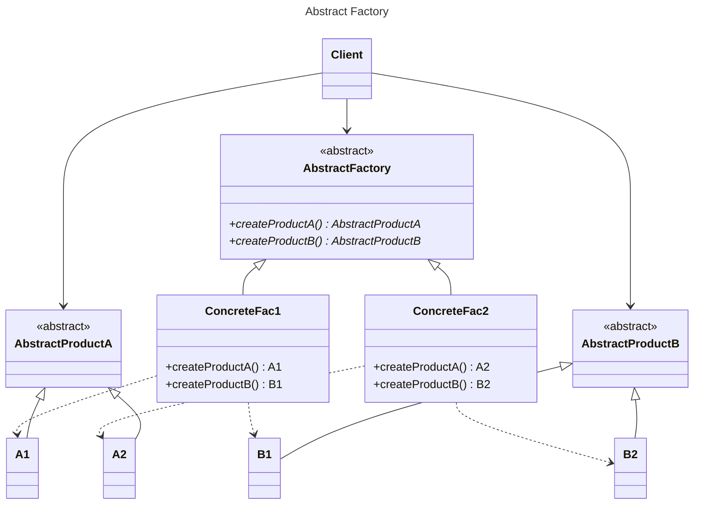

#### 1.1 When to use the Abstract Factory Design Pattern
* A system should be independent of how its products are created, composed, and represented.
* A system should be configured with one of multiple families of products.
* A family of related product objects is designed to be used together, and you need to enforce this constraint.
* You want to provide a class library of products, and you want to reveal just their interfaces, not their implementations

### 2. Builder
separate object construction from its representation (to make the object smaller).

Example: sign-up form.

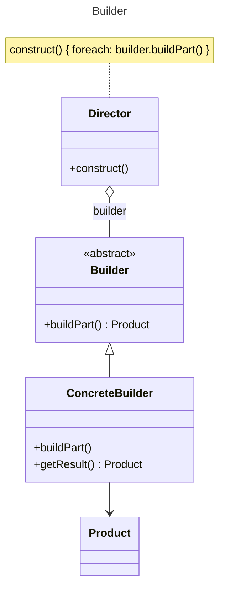

#### 2.1 When to use the Builder Pattern
* The algorithm for creating a complex object should be independent of the parts that make up the object and how they’re
assembled.
* The construction process must allow different representations for the object that’s constructed.

#### 2.2 Builder Pattern in JDK
* java.lang.StringBuilder#append() (unsynchronized)
* java.lang.StringBuffer#append() (synchronized)

### 3. Factory Method
create an instance of several derived methods.

In other words, it defines an interface for creating an object, but let subclasses decide which
class to instantiate.

Example: XML parsers for each specific XML format.
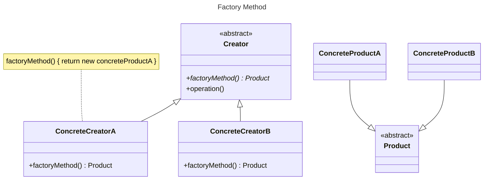

#### 3.1 When to use the Factory Method Pattern
* A class can’t anticipate the class of objects it must create.
* A class wants its subclasses to specify the objects it creates.
* Classes delegate responsibility to one of several helper subclasses, and you want to localize the knowledge of which helper
subclass is the delegate.

### 4. Prototype
a fully initialized object is copied into another object.
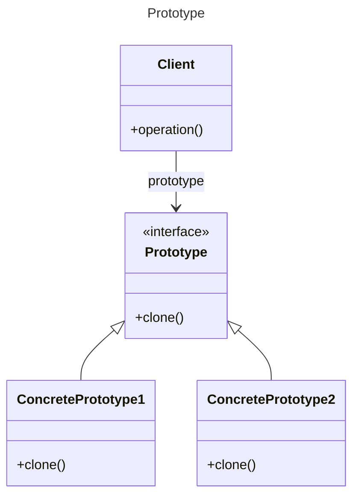

#### 4.1 When to use the Prototype Design Pattern
Use the Prototype pattern when a system should be independent of how its products are created, composed, and represented; and
* When the classes to instantiate are specified at run-time, for example, by dynamic loading; or
* To avoid building a class hierarchy of factories that parallels the class hierarchy of products; or
* When instances of a class can have one of only a few different combinations of state. It may be more convenient to install a
corresponding number of prototypes and clone them rather than instantiating the class manually, each time with the appropriate
state.

#### 4.2 Prototype Pattern in JDK
* java.lang.Object#clone()
* java.lang.Cloneable

### 5. Singleton
ensure a class has only one instance, and provide a global point of access to it.
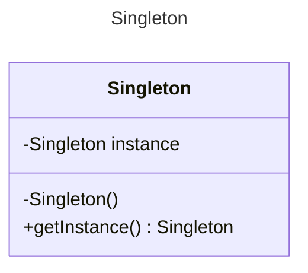

Apart from this, there are some other ways to break the singleton pattern.
* If the class is Serializable.
* If it’s Clonable.
* It can be broken by Reflection.
* And also if, the class is loaded by multiple class loaders.

There is one simple and easier way of creating a singleton class. As of JDK 1.5, you
can create a singleton class using enums.
```java
public class SingletonEnum {

  public enum SingleEnum{
    SINGLETON_ENUM;
  }
}
```

* You will get a compile time error when you attempt to explicitly instantiate an Enum object.
* As Enum gets loaded statically, it is thread-safe.
* The clone method in Enum is final which ensures that enum constants never get cloned.
* Enum is inherently serializable, the serialization mechanism ensures that duplicate instances are never created as a result of deserialization. Instantiation
using reflection is also prohibited.
* These things ensure that no instance of an enum exists beyond the one defined by the enum
constants.

## 2. Structural Patterns.
Structural patterns are concerned with how classes and objects are composed to form larger structures.

### 1. Adapter
match interface of different classes.

Example: an adapter for an API.
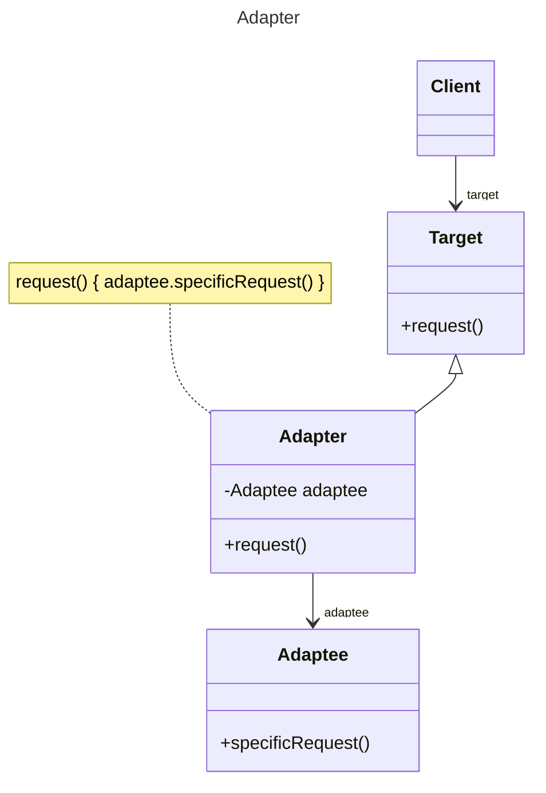
#### 1.1. When to use Adapter Pattern
* There is an existing class, and its interface does not match the one you need.
* You want to create a reusable class that cooperates with unrelated or unforeseen classes, that is, classes that don’t necessarily
have compatible interfaces.
* There are several existing subclasses to be used, but it’s impractical to adapt their interface by subclassing every one. An object
adapter can adapt the interface of its parent class.

### 2. Bridge
separate an object & interface from implementation.

The Bridge Pattern’s intent is to decouple an abstraction from its implementation so that the two can vary independently. It puts
the abstraction and implementation into two different class hierarchies so that both can be extended independently.
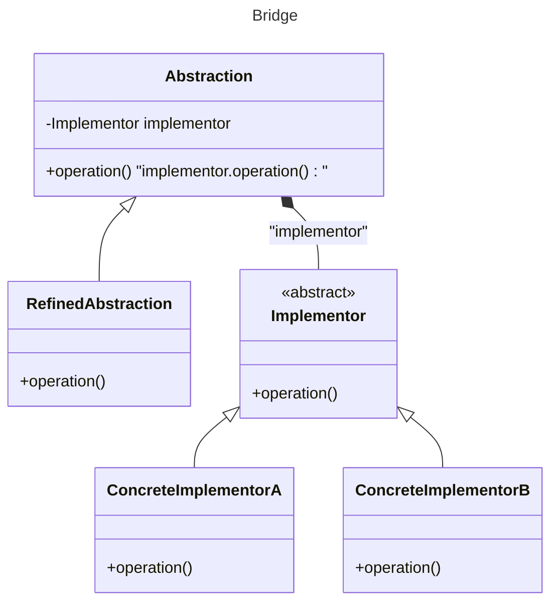

#### 2.1 Use of Bridge Pattern
* You want to avoid a permanent binding between an abstraction and its implementation. This might be the case, for example,
when the implementation must be selected or switched at run-time.
* Both the abstractions and their implementations should be extensible by sub-classing. In this case, the Bridge pattern lets you
combine the different abstractions and implementations and extend them independently.
* Changes in the implementation of an abstraction should have no impact on clients; that is, their code should not have to be
recompiled.
* You want to share an implementation among multiple objects (perhaps using reference counting), and this fact should be hidden
from the client.

### 3. Composite
a tree structure of simple and composite objects. In Composite Pattern, elements with children are called as Nodes, and elements without
children are called as Leafs.

example: XML parser, file system, HTML representation, a hierarchy.
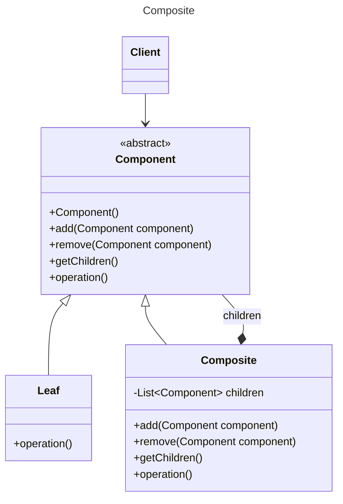

### 4. Decorator
add responsibilities to an object dynamically.
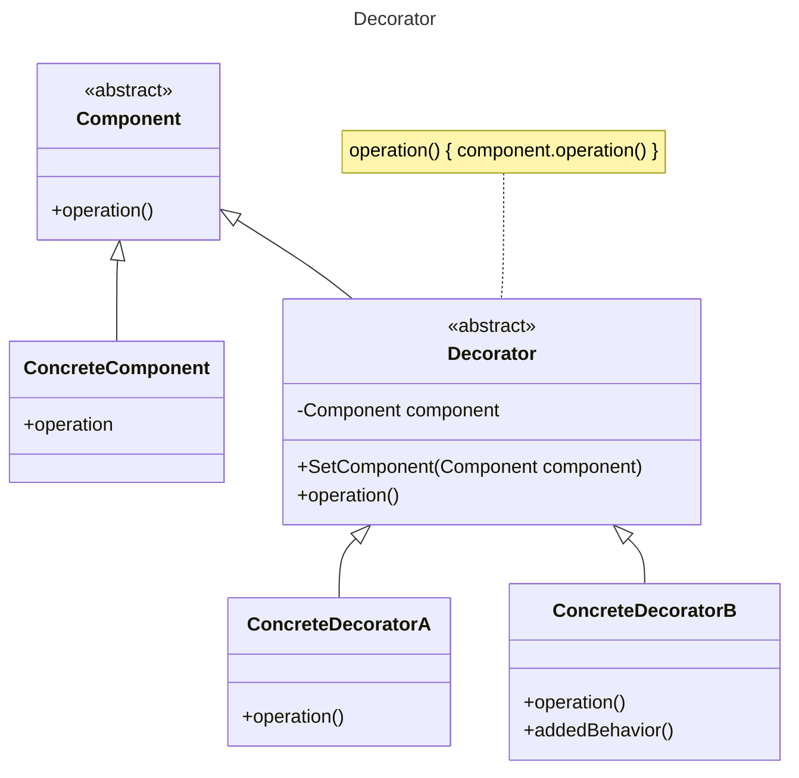

#### 4.1 When to use the Decorator Design Pattern
* To add responsibilities to individual objects dynamically and transparently, that is, without affecting other objects.
* For responsibilities that can be withdrawn.
* When extension by sub-classing is impractical. Sometimes a large number of independent extensions are possible and would
produce an explosion of subclasses to support every combination. Or a class definition may be hidden or otherwise unavailable
for sub-classing

#### 4.2 Example:
* Component: Pizza (properties: size, price)
* ConcreteComponent: VeggiePizza, MeatLoverPizza
* Decorator: Topping
* ConcreteDecorator: Cheese, Chicken, Pineapple, Onion

### 5. Facade
a single class that represents an entire subsystem.
example: a mortgage application.

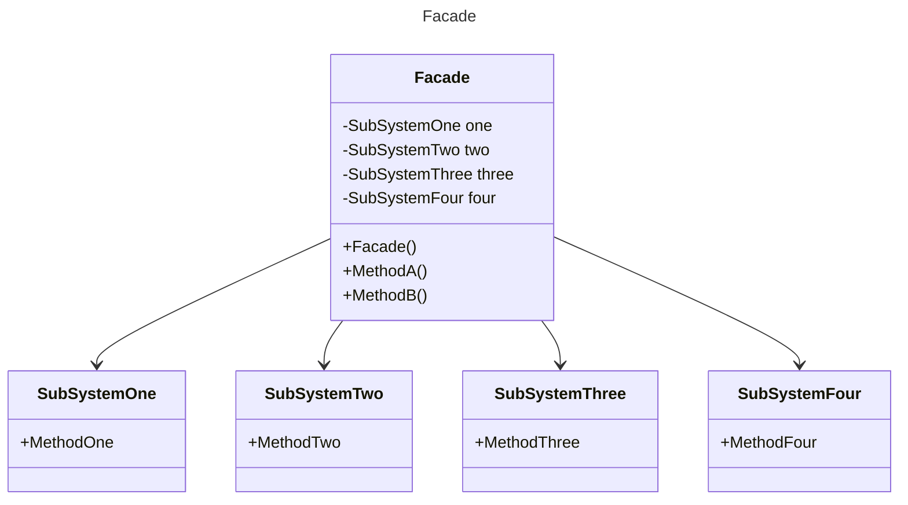
  Note:
  a Facade same as an Adapter can wrap multiple classes, but a facade is used to an interface to simplify the use
of the complex interface, whereas, an adapter is used to convert the interface to an interface the client expects.

### 6. Flyweight
a fine-grained instance used for efficient sharing.
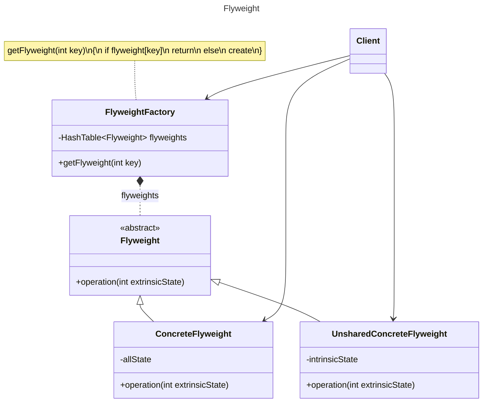

#### 6.1 When to use the Flyweight Pattern
Apply the Flyweight pattern when all the following are true:
* An application uses a large number of objects.
* Storage costs are high because of the sheer quantity of objects.
* Most object state can be made extrinsic.
* Many groups of objects may be replaced by relatively few shared objects once extrinsic state is removed.
* The application doesn’t depend on object identity. Since flyweight objects may be shared, identity tests will return true for
conceptually distinct objects.

### 7. Proxy
an object representing another object, which may be remote, expensive
to create or in need of being secured.
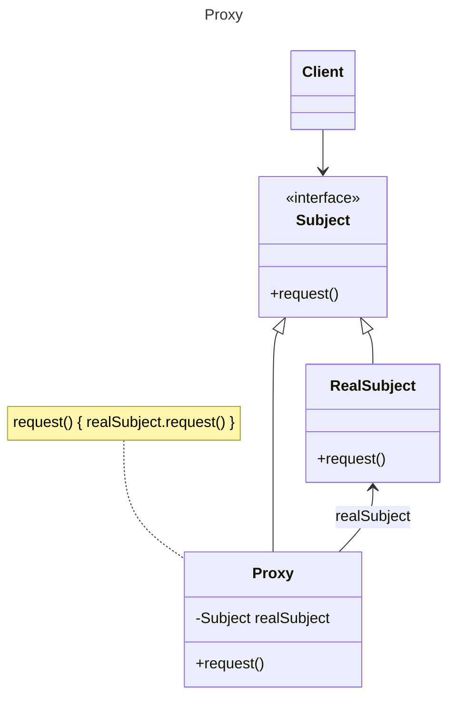

## 3. Behavioral Patterns.
Behavioral patterns are concerned with algorithms and the assignment of responsibilities between objects.
Behavioral object patterns use object composition rather than inheritance.

### 1. Chain of Responsibility
### 2. Command
### 3. Interpreter
### 4. Iterator
### 5. Mediator
### 6. Memento
### 7. Observer
### 8. State
### 9. Strategy
### 10. Template Method
### 11. Visitor
