# Java-Design-Patterns
Design Patterns in Java.
<details>
   <summary>Design Patterns</summary>

- [1. Creational Patterns](#creational)
  - [1. Abstract Factory (Factory of Factories) ](#AbstractFactory)
  - [2. Builder ](#Builder)
  - [3. Factory Method ](#FactoryMethod)
  - [4. Prototype ](#Prototype)
  - [5. Singleton ](#Singleton)
- [2. Structural Patterns](#structural)
  - [1. Adapter ](#Adapter)
  - [2. Bridge ](#Bridge)
  - [3. Composite ](#Composite)
  - [4. Decorator ](#Decorator)
  - [5. Facade ](#Facade)
  - [6. Flyweight ](#Flyweight)
  - [7. Proxy ](#Proxy)
- [3. Behavioral Patterns. ](#behavioral)
  - [1. Chain of Responsibility ](#ChainOfResponsibility)
  - [2. Command ](#Command)
  - [3. Interpreter ](#Interpreter)
  - [4. Iterator ](#Iterator)
  - [5. Mediator ](#Mediator)
  - [6. Memento ](#Memento)
  - [7. Observer ](#Observer)
  - [8. State ](#State)
  - [9. Strategy ](#Strategy)
  - [10. Template Method ](#TemplateMethod)
  - [11. Visitor ](#Visitor)

</details>

## 1. Creational Patterns. <a name="creational"></a>
Creational design patterns are used to design the instantiation process of objects.

### 1. Abstract Factory (Factory of Factories) <a name="AbstractFactory"></a>
create a family of related objects without specifying their concrete classes.
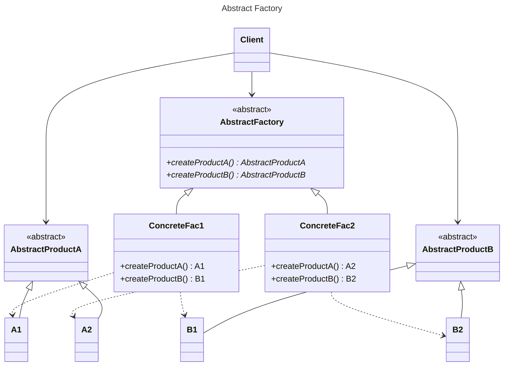
```mermaid
---
title: Abstract Factory
---
classDiagram
    class AbstractFactory {
        <<abstract>>
        +createProductA() AbstractProductA*
        +createProductB() AbstractProductB*
    }
    
    AbstractFactory <|-- ConcreteFac1
    AbstractFactory <|-- ConcreteFac2
    
    class ConcreteFac1 {
        +createProductA() A1
        +createProductB() B1
    }

    class ConcreteFac2 {
        +createProductA() A2
        +createProductB() B2
    }
    
    class AbstractProductA
    <<abstract>> AbstractProductA
    AbstractProductA <|-- A1
    AbstractProductA <|-- A2

    class AbstractProductB
    <<abstract>> AbstractProductB
    AbstractProductB <|-- B1
    AbstractProductB <|-- B2
    
    Client --> AbstractFactory
    Client --> AbstractProductA
    Client --> AbstractProductB
    
    ConcreteFac1 ..> A1
    ConcreteFac1 ..> B1
    
    ConcreteFac2 ..> A2
    ConcreteFac2 ..> B2
```

#### 1.1 When to use the Abstract Factory Design Pattern
* A system should be independent of how its products are created, composed, and represented.
* A system should be configured with one of multiple families of products.
* A family of related product objects is designed to be used together, and you need to enforce this constraint.
* You want to provide a class library of products, and you want to reveal just their interfaces, not their implementations

### 2. Builder <a name="Builder"></a>
separate object construction from its representation (to make the object smaller).

Example: sign-up form.

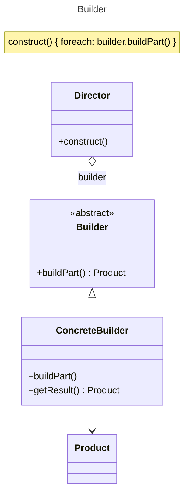
```mermaid
---
title: Builder
---
classDiagram
    class Builder {
        <<abstract>>
        +buildPart() Product
    }

    note for Director "construct() { foreach: builder.buildPart() }"
    Director o-- Builder : builder
    Director : +construct()
    
    Builder <|-- ConcreteBuilder
    class ConcreteBuilder {
        +buildPart()
        +getResult() Product
    }
    
    ConcreteBuilder --> Product
```

#### 2.1 When to use the Builder Pattern
* The algorithm for creating a complex object should be independent of the parts that make up the object and how they’re
assembled.
* The construction process must allow different representations for the object that’s constructed.

#### 2.2 Builder Pattern in JDK
* java.lang.StringBuilder#append() (unsynchronized)
* java.lang.StringBuffer#append() (synchronized)

### 3. Factory Method <a name="FactoryMethod"></a>
create an instance of several derived methods.

In other words, it defines an interface for creating an object, but let subclasses decide which
class to instantiate.

Example: XML parsers for each specific XML format.
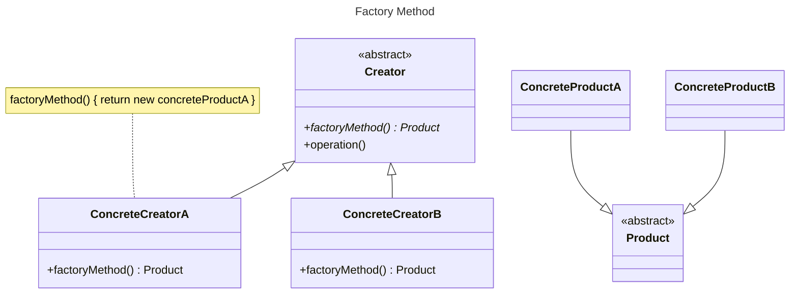
```mermaid
---
title: Factory Method
---
classDiagram
    class Creator {
        <<abstract>>
        +factoryMethod() Product*
        +operation()
    }
    
    Creator <|-- ConcreteCreatorA
    Creator <|-- ConcreteCreatorB
    
    note for ConcreteCreatorA "factoryMethod() { return new concreteProductA }"
    ConcreteCreatorA : +factoryMethod() Product
    
    ConcreteCreatorB : +factoryMethod() Product
    
    class Product {
        <<abstract>>
    }

    ConcreteProductA --|> Product
    ConcreteProductB --|> Product
```

#### 3.1 When to use the Factory Method Pattern
* A class can’t anticipate the class of objects it must create.
* A class wants its subclasses to specify the objects it creates.
* Classes delegate responsibility to one of several helper subclasses, and you want to localize the knowledge of which helper
subclass is the delegate.

### 4. Prototype <a name="Prototype"></a>
a fully initialized object is copied into another object.
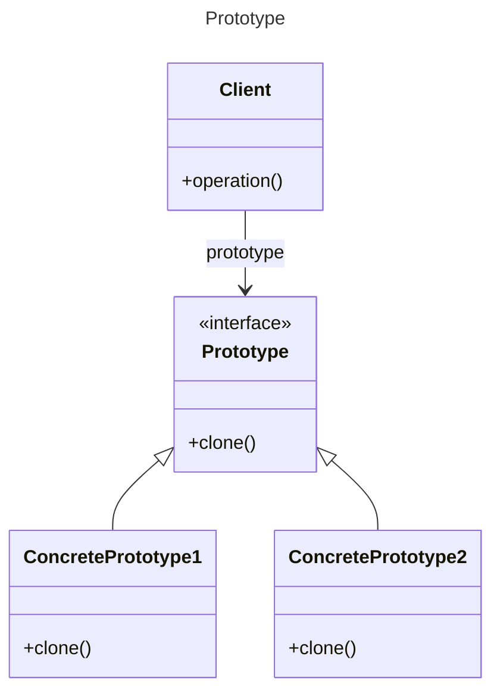
```mermaid
---
title: Prototype
---
classDiagram
    class Prototype {
        <<interface>>
        +clone()
    }
    
    Prototype <|-- ConcretePrototype1
    Prototype <|-- ConcretePrototype2
    
    class ConcretePrototype1 {
        +clone()
    }

    class ConcretePrototype2 {
        +clone()
    }
    
    Client --> Prototype : prototype
    Client : +operation()    
```

#### 4.1 When to use the Prototype Design Pattern
Use the Prototype pattern when a system should be independent of how its products are created, composed, and represented; and
* When the classes to instantiate are specified at run-time, for example, by dynamic loading; or
* To avoid building a class hierarchy of factories that parallels the class hierarchy of products; or
* When instances of a class can have one of only a few different combinations of state. It may be more convenient to install a
corresponding number of prototypes and clone them rather than instantiating the class manually, each time with the appropriate
state.

#### 4.2 Prototype Pattern in JDK
* java.lang.Object#clone()
* java.lang.Cloneable

### 5. Singleton <a name="Singleton"></a>
ensure a class has only one instance, and provide a global point of access to it.
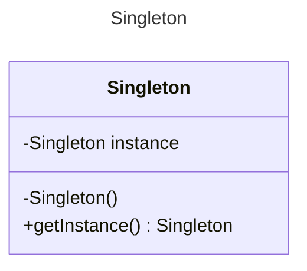
```mermaid
---
title: Singleton
---
classDiagram
    class Singleton {
        -Singleton instance
        -Singleton()
        +getInstance() Singleton
    }
```

Apart from this, there are some other ways to break the singleton pattern.
* If the class is Serializable.
* If it’s Clonable.
* It can be broken by Reflection.
* And also if, the class is loaded by multiple class loaders.

There is one simple and easier way of creating a singleton class. As of JDK 1.5, you
can create a singleton class using enums.
```java
public class SingletonEnum {

  public enum SingleEnum{
    SINGLETON_ENUM;
  }
}
```

* You will get a compile time error when you attempt to explicitly instantiate an Enum object.
* As Enum gets loaded statically, it is thread-safe.
* The clone method in Enum is final which ensures that enum constants never get cloned.
* Enum is inherently serializable, the serialization mechanism ensures that duplicate instances are never created as a result of deserialization. Instantiation
using reflection is also prohibited.
* These things ensure that no instance of an enum exists beyond the one defined by the enum
constants.


## 2. Structural Patterns. <a name="structural"></a>
Structural patterns are concerned with how classes and objects are composed to form larger structures.

### 1. Adapter <a name="Adapter"></a>
match interface of different classes.

Example: an adapter for an API.
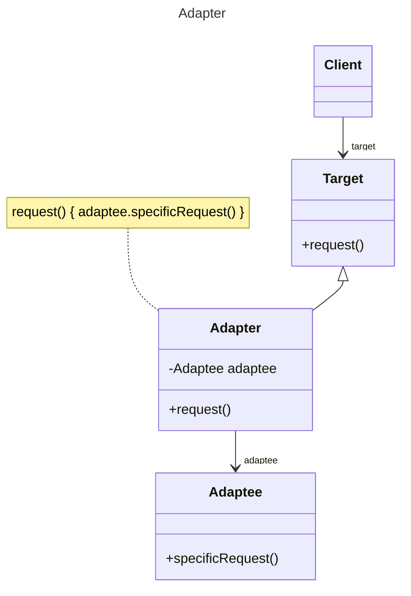
```mermaid
---
title: Adapter
---
classDiagram
    Client --> "target" Target
    
    Target: +request()
    Target <|-- Adapter
    
    note for Adapter "request() { adaptee.specificRequest() }"
    Adapter: -Adaptee adaptee
    Adapter: +request()
    Adapter --> "adaptee" Adaptee
    Adaptee: +specificRequest()
```
#### 1.1. When to use Adapter Pattern
* There is an existing class, and its interface does not match the one you need.
* You want to create a reusable class that cooperates with unrelated or unforeseen classes, that is, classes that don’t necessarily
have compatible interfaces.
* There are several existing subclasses to be used, but it’s impractical to adapt their interface by subclassing every one. An object
adapter can adapt the interface of its parent class.

### 2. Bridge <a name="Bridge"></a>
separate an object & interface from implementation.

The Bridge Pattern’s intent is to decouple an abstraction from its implementation so that the two can vary independently. It puts
the abstraction and implementation into two different class hierarchies so that both can be extended independently.
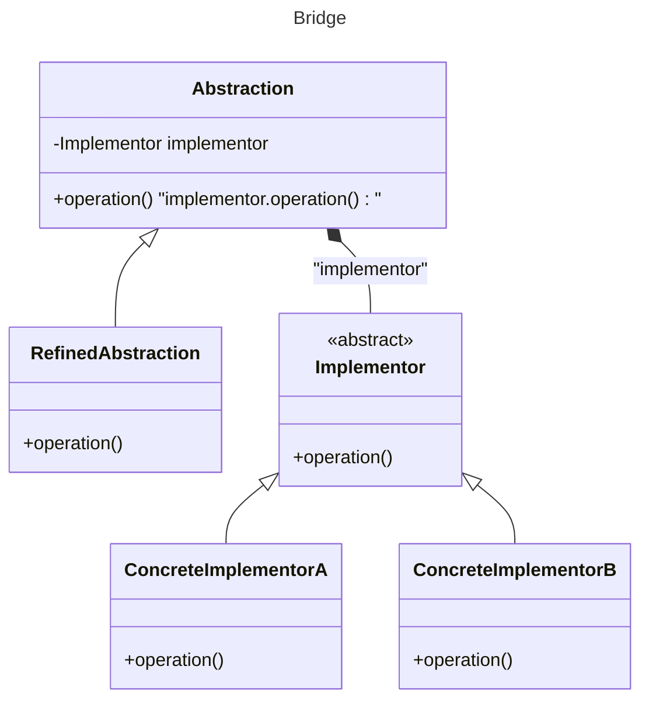
```mermaid
---
title: Bridge
---
classDiagram
    class Abstraction {
        -Implementor implementor
        +operation() "implementor.operation()"
    }
    
    
    Abstraction <|-- RefinedAbstraction
    RefinedAbstraction: +operation()
    
    class Implementor {
        <<abstract>>
        +operation()
    }

    Abstraction *-- Implementor : "implementor"
    
    Implementor <|-- ConcreteImplementorA
    Implementor <|-- ConcreteImplementorB
    
    ConcreteImplementorA: +operation()
    ConcreteImplementorB: +operation()
```

#### 2.1 Use of Bridge Pattern
* You want to avoid a permanent binding between an abstraction and its implementation. This might be the case, for example,
when the implementation must be selected or switched at run-time.
* Both the abstractions and their implementations should be extensible by sub-classing. In this case, the Bridge pattern lets you
combine the different abstractions and implementations and extend them independently.
* Changes in the implementation of an abstraction should have no impact on clients; that is, their code should not have to be
recompiled.
* You want to share an implementation among multiple objects (perhaps using reference counting), and this fact should be hidden
from the client.

### 3. Composite <a name="Composite"></a>
a tree structure of simple and composite objects. In Composite Pattern, elements with children are called as Nodes, and elements without
children are called as Leafs.

example: XML parser, file system, HTML representation, a hierarchy.
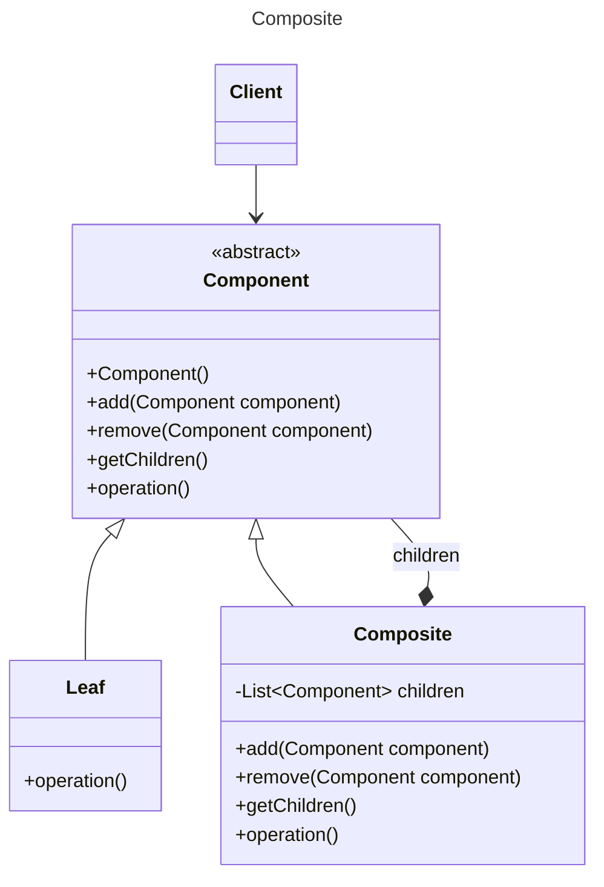
```mermaid
---
title: Composite
---
classDiagram
    Client --> Component
    class Component {
        <<abstract>>
        +Component()
        +add(Component component)
        +remove(Component component)
        +getChildren()
        +operation()
    }
    
    Component <|-- Leaf
    Component <|-- Composite
    Component --* Composite : children
    
    Leaf: +operation()
    class Composite {
        -List~Component~ children
        +add(Component component)
        +remove(Component component)
        +getChildren()
        +operation()
    }
```

### 4. Decorator <a name="Decorator"></a>
add responsibilities to an object dynamically.
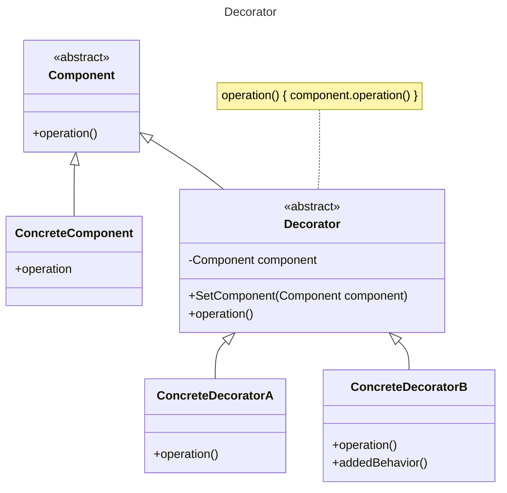
```mermaid
---
title: Decorator
---
classDiagram
    class Component {
        <<abstract>>
        +operation()
    }
    
    Component <|-- ConcreteComponent
    ConcreteComponent: +operation
    
    Component <|-- Decorator
    
    note for Decorator "operation() { component.operation() }"
    class Decorator {
        <<abstract>>
        -Component component
        +SetComponent(Component component)
        +operation()
    }
    
    Decorator <|-- ConcreteDecoratorA
    Decorator <|-- ConcreteDecoratorB
    
    ConcreteDecoratorA: +operation()
    
    class ConcreteDecoratorB {
        +operation()
        +addedBehavior()
    }
    
```

#### 4.1 When to use the Decorator Design Pattern
* To add responsibilities to individual objects dynamically and transparently, that is, without affecting other objects.
* For responsibilities that can be withdrawn.
* When extension by sub-classing is impractical. Sometimes a large number of independent extensions are possible and would
produce an explosion of subclasses to support every combination. Or a class definition may be hidden or otherwise unavailable
for sub-classing

#### 4.2 Example:
* Component: Pizza (properties: size, price)
* ConcreteComponent: VeggiePizza, MeatLoverPizza
* Decorator: Topping
* ConcreteDecorator: Cheese, Chicken, Pineapple, Onion

### 5. Facade <a name="Facade"></a>
a single class that represents an entire subsystem.
example: a mortgage application.

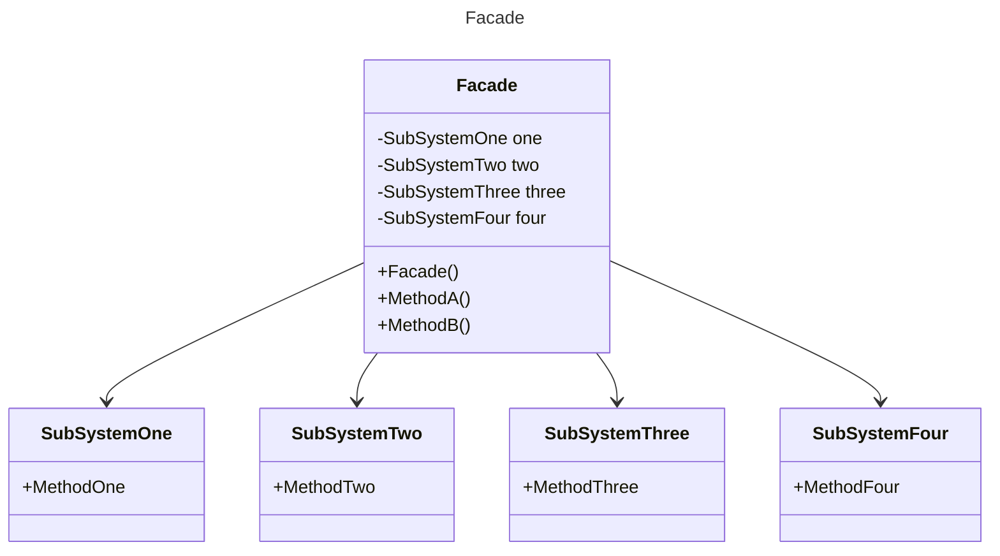
```mermaid
---
title: Facade
---
classDiagram
    class Facade {
        -SubSystemOne one
        -SubSystemTwo two
        -SubSystemThree three
        -SubSystemFour four
        +Facade()
        +MethodA()
        +MethodB()
    }

    Facade --> SubSystemOne
    Facade --> SubSystemTwo
    Facade --> SubSystemThree
    Facade --> SubSystemFour
    
    SubSystemOne: +MethodOne
    SubSystemTwo: +MethodTwo
    SubSystemThree: +MethodThree
    SubSystemFour: +MethodFour
```
  Note:
  a Facade same as an Adapter can wrap multiple classes, but a facade is used to an interface to simplify the use
of the complex interface, whereas, an adapter is used to convert the interface to an interface the client expects.

### 6. Flyweight <a name="Flyweight"></a>
a fine-grained instance used for efficient sharing.
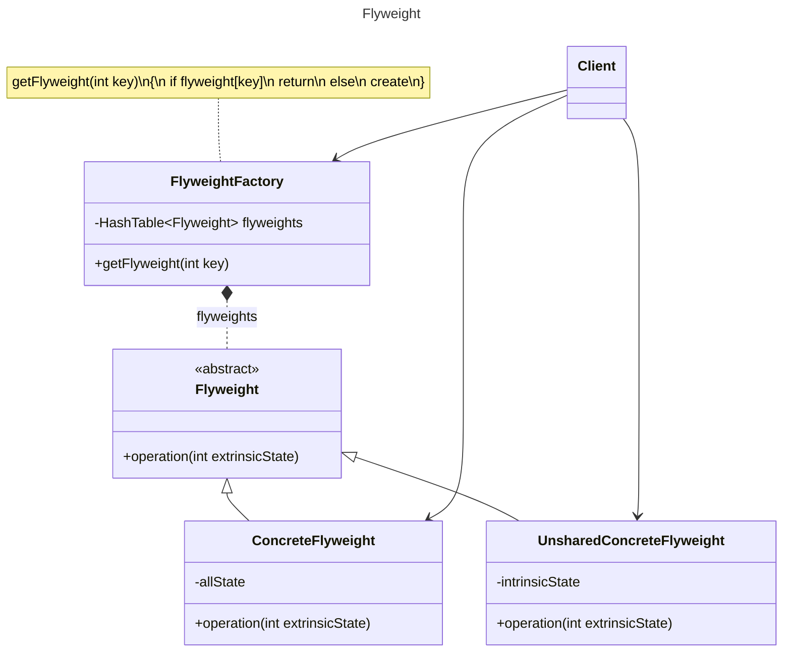
```mermaid
---
title: Flyweight
---
classDiagram
    note for FlyweightFactory "getFlyweight(int key)\n{\n  if flyweight[key]\n    return\n  else\n    create\n}"
    class FlyweightFactory {
        -HashTable~Flyweight~ flyweights
        +getFlyweight(int key)
    }
    
    FlyweightFactory *.. Flyweight : flyweights
    
    class Flyweight {
        <<abstract>>
        +operation(int extrinsicState)
    }
    
    Flyweight <|-- ConcreteFlyweight
    Flyweight <|-- UnsharedConcreteFlyweight
    
    class ConcreteFlyweight {
        -allState
        +operation(int extrinsicState)
    }
    
    class UnsharedConcreteFlyweight {
        -intrinsicState
        +operation(int extrinsicState)
    }
    
    Client --> ConcreteFlyweight
    Client --> UnsharedConcreteFlyweight
    Client --> FlyweightFactory
```

#### 6.1 When to use the Flyweight Pattern
Apply the Flyweight pattern when all the following are true:
* An application uses a large number of objects.
* Storage costs are high because of the sheer quantity of objects.
* Most object state can be made extrinsic.
* Many groups of objects may be replaced by relatively few shared objects once extrinsic state is removed.
* The application doesn’t depend on object identity. Since flyweight objects may be shared, identity tests will return true for
conceptually distinct objects.

### 7. Proxy <a name="Proxy"></a>
an object representing another object, which may be remote, expensive
to create or in need of being secured.
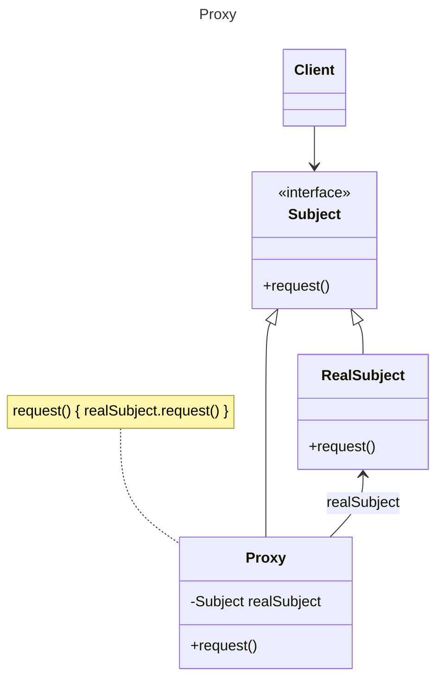
```mermaid
---
title: Proxy
---
classDiagram
    Client --> Subject
    
    class Subject {
        <<interface>>
        +request()
    }
    
    Subject <|-- RealSubject
    Subject <|-- Proxy
    
    RealSubject: +request()
    RealSubject <-- Proxy : realSubject
    
    note for Proxy "request() { realSubject.request() }"
    Proxy: -Subject realSubject
    Proxy: +request()
```


## 3. Behavioral Patterns. <a name="behavioral"></a>
Behavioral patterns are concerned with algorithms and the assignment of responsibilities between objects.
Behavioral object patterns use object composition rather than inheritance.

### 1. Chain of Responsibility <a name="ChainOfResponsibility"></a>
a way of passing request between a chain of objects.
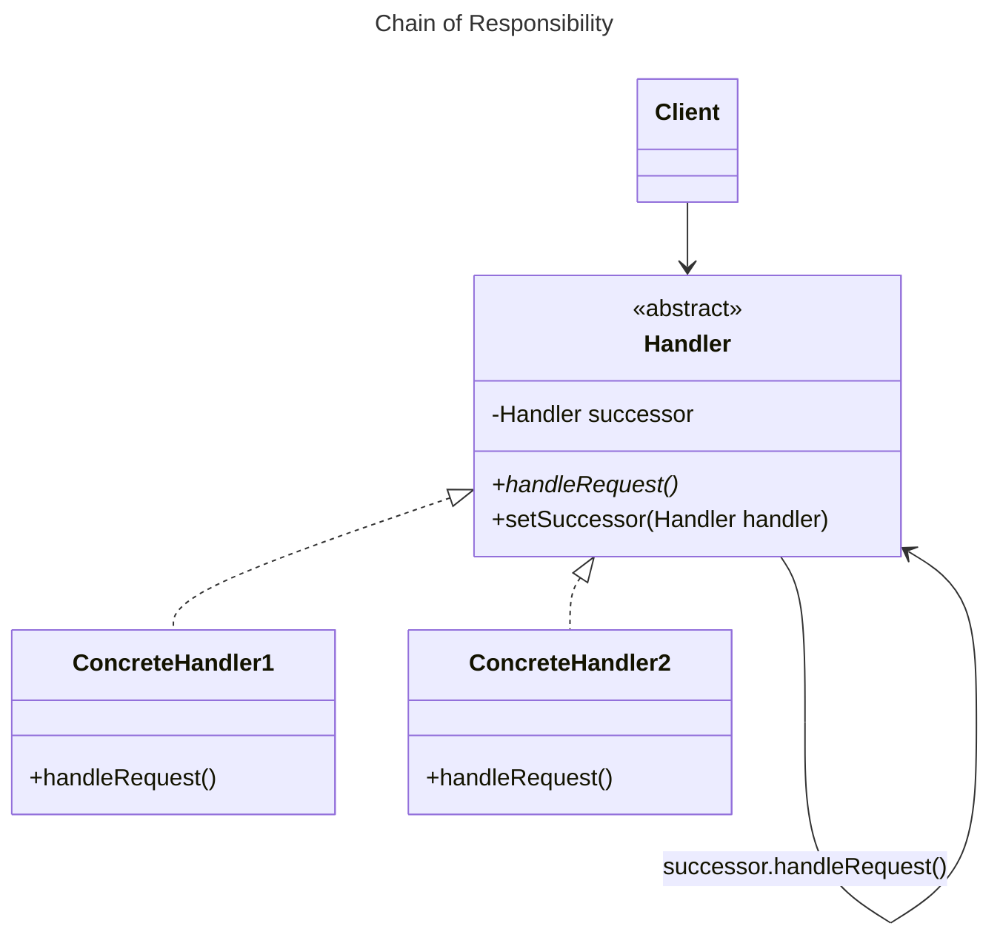
```mermaid
---
title: Chain of Responsibility
---
classDiagram
    Client --> Handler
    class Handler {
        <<abstract>>
        -Handler successor
        +handleRequest()*
        +setSuccessor(Handler handler)
    }
    
    Handler <|.. ConcreteHandler1
    Handler <|.. ConcreteHandler2
    
    ConcreteHandler1: +handleRequest()
    ConcreteHandler2: +handleRequest()

  Handler --> Handler : successor.handleRequest()
```

#### 1.1 When to use the Chain of Responsibility Design Pattern
* More than one objects may handle a request, and the handler isn’t known a priori. The handler should be ascertained automatically.
* You want to issue a request to one of several objects without specifying the receiver explicitly.
* The set of objects that can handle a request should be specified dynamically.

#### 1.2 Chain of Responsibility in JDK
* java.util.logging.Logger#log()
* javax.servlet.Filter#doFilter()

### 2. Command <a name="Command"></a>
encapsulate a command request as an object.
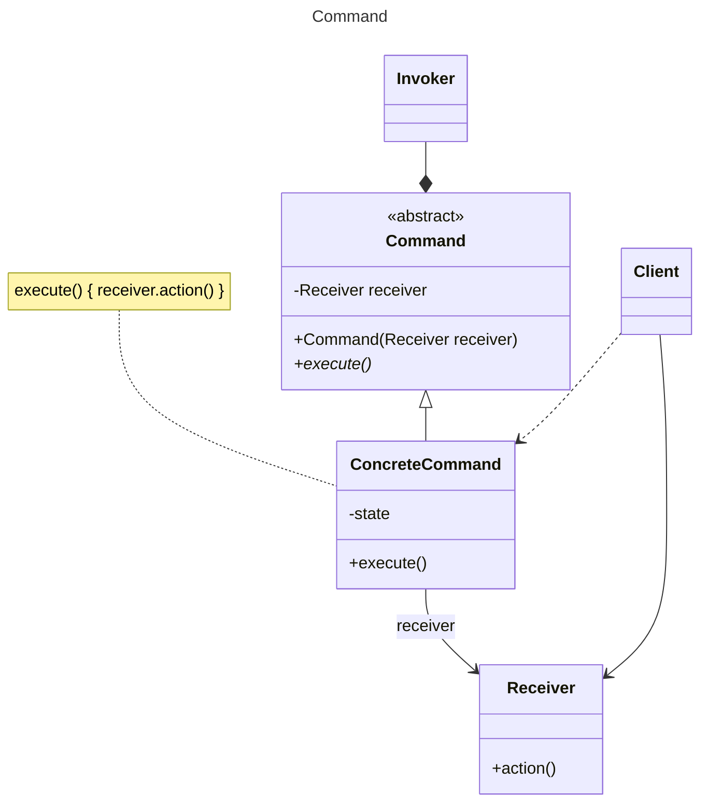
```mermaid
---
title: Command
---
classDiagram
    Invoker --* Command
    class Command {
        <<abstract>>
        -Receiver receiver
        +Command(Receiver receiver)
        +execute()*
    }
    
    Command <|-- ConcreteCommand
    note for ConcreteCommand "execute() { receiver.action() }"
    class ConcreteCommand {
        -state
        +execute()
    }
    
    ConcreteCommand --> Receiver : receiver
    Receiver: +action()
    
    Client --> Receiver
    Client ..> ConcreteCommand
```

#### 2.1 When to use the Command Design Pattern
* Parameterize objects by an action to perform.
* Specify, queue, and execute requests at different times. A Command object can have a lifetime independent of the original
request. If the receiver of a request can be represented in an address space-independent way, then you can transfer a command
object for the request to a different process and fulfill the request there.
* Support undo. The Command’s Execute operation can store state for reversing its effects in the command itself. The
Command interface must have an added Un-execute operation that reverses the effects of a previous call to Execute.
Executed commands are stored in a history list. Unlimited-level undo and redo is achieved by traversing this list backwards
and forwards calling Un-execute and Execute, respectively.
* Support logging changes so that they can be reapplied in case of a system crash. By augmenting the Command interface
with load and store operations, you can keep a persistent log of changes. Recovering from a crash involves reloading logged
commands from disk and re-executing them with the Execute operation.
* Structure a system around high-level operations built on primitives operations. Such a structure is common in information
systems that support transactions. A transaction encapsulates a set of changes to data. The Command pattern offers a way to
model transactions. Commands have a common interface, letting you invoke all transactions the same way. The pattern also
makes it easy to extend the system with new transactions.

### 3. Interpreter <a name="Interpreter"></a>
a way to include language elements in a program.
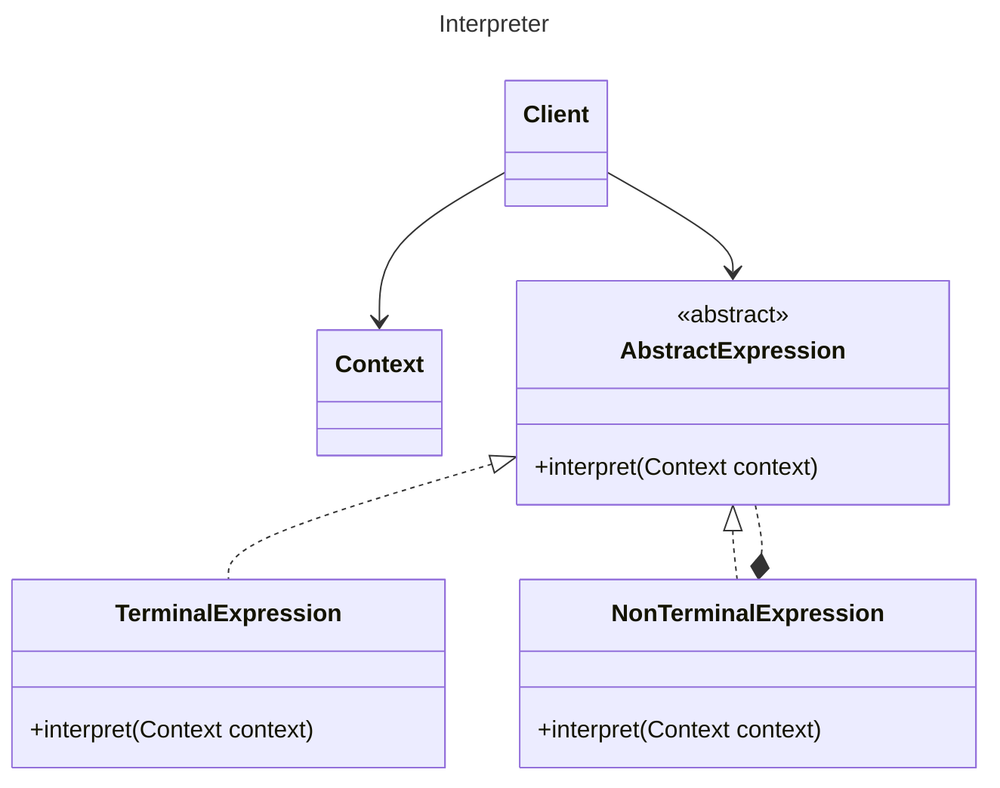
```mermaid
---
title: Interpreter
---
classDiagram
    Client --> Context
    Client --> AbstractExpression
    
    class AbstractExpression {
        <<abstract>>
        +interpret(Context context)
    }
    
    AbstractExpression <|.. TerminalExpression
    TerminalExpression: +interpret(Context context)
    
    AbstractExpression <|.. NonTerminalExpression
    NonTerminalExpression: +interpret(Context context)
    NonTerminalExpression *.. AbstractExpression
    
```

#### 3.1 When to use the Interpreter Design Pattern
Use the Interpreter pattern when there is a language to interpret, and you can represent statements in the language as abstract
syntax trees. The Interpreter pattern works best when:
* The grammar is simple. For complex grammars, the class hierarchy for the grammar becomes large and unmanageable. Tools
such as parser generators are a better alternative in such cases. They can interpret expressions without building abstract syntax
trees, which can save space and possibly time.
* Efficiency is not a critical concern. The most efficient interpreters are usually not implemented by interpreting parse trees
directly but by first translating them into another form. For example, regular expressions are often transformed into state
machines. But even then, the translator can be implemented by the Interpreter pattern, so the pattern is still applicable.

#### 3.2Interpreter Design Pattern in JDK
* java.util.Pattern
* java.text.Normalizer
* java.text.Format

### 4. Iterator <a name="Iterator"></a>
sequentially access the elements of a collection (without exposing its underlying representation).
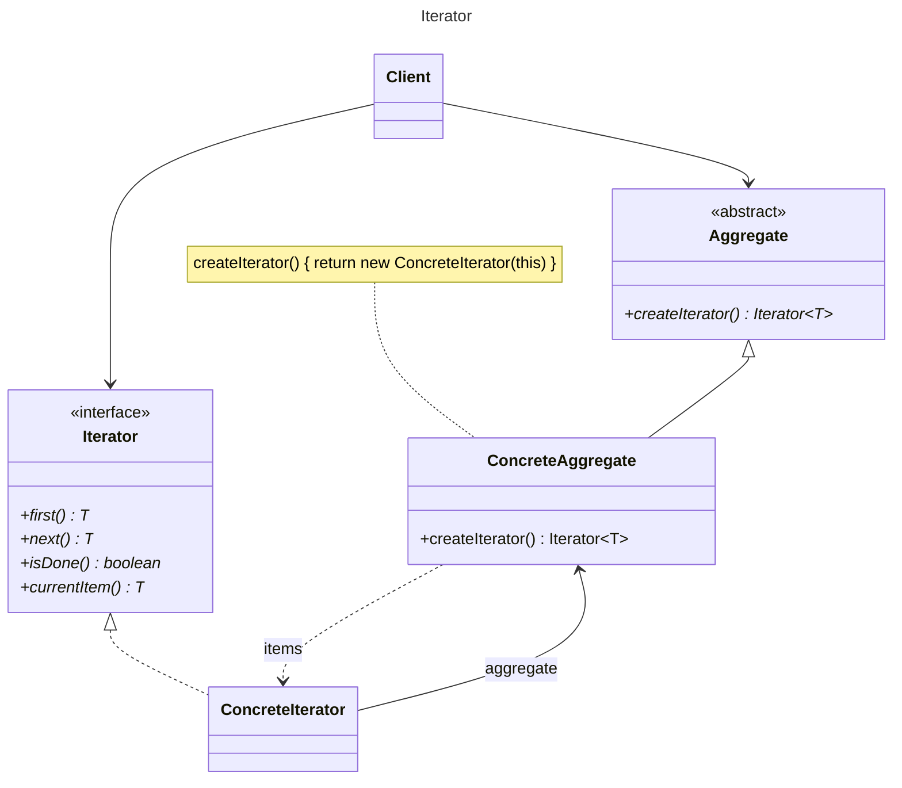
```mermaid
---
title: Iterator
---
classDiagram
    Client --> Aggregate
    Client --> Iterator
    
    class Aggregate~T`~ {
        <<abstract>>
        +createIterator() Iterator~T~*
    }
    
    Aggregate <|-- ConcreteAggregate
    note for ConcreteAggregate "createIterator() { return new ConcreteIterator(this) }"
    ConcreteAggregate~T~: +createIterator() Iterator~T~
    
    class Iterator~T~ {
        <<interface>>
        +first() T*
        +next() T*
        +isDone() boolean*
        +currentItem() T*
    }
    
    Iterator <|.. ConcreteIterator
    
    ConcreteAggregate ..> ConcreteIterator : items
    ConcreteAggregate <-- ConcreteIterator : aggregate
    
```

#### 4.1 Internal and External Iterators
An iterator can be designed either as an internal iterator or as an external iterator.

##### 4.1.2 Internal Iterators
* The collection itself offers methods to allow a client to visit different objects within the collection. For example, the `java.
util.ResultSet` class contains the data and also offers methods such as next to navigate through the item list.
* There can be only one iterator on a collection at any given time.
* The collection has to maintain or save the state of iteration.


##### 4.1.3 External Iterators
* The iteration functionality is separated from the collection and kept inside a different object referred to as an iterator. Usually,
the collection itself returns an appropriate iterator object to the client depending on the client input. For example, the `java.
util.Vector` class has its iterator defined in the form of a separate object of type Enumeration. This object is returned
to a client object in response to the elements() method call.
* There can be multiple iterators on a given collection at any given time.
* The overhead involved in storing the state of iteration is not associated with the collection. It lies with the exclusive Iterator
object. 

#### 4.2 When to use the Iterator Design Pattern
* To access an aggregate object’s contents without exposing its internal representation.
* To support multiple traversals of aggregate objects.
* To provide a uniform interface for traversing different aggregate structures (that is, to support polymorphic iteration). 

#### 4.3 Iterator Pattern in JDK
* java.util.Iterator
* java.util.Enumeration

### 5. Mediator <a name="Mediator"></a>
defines simplified communication between classes.
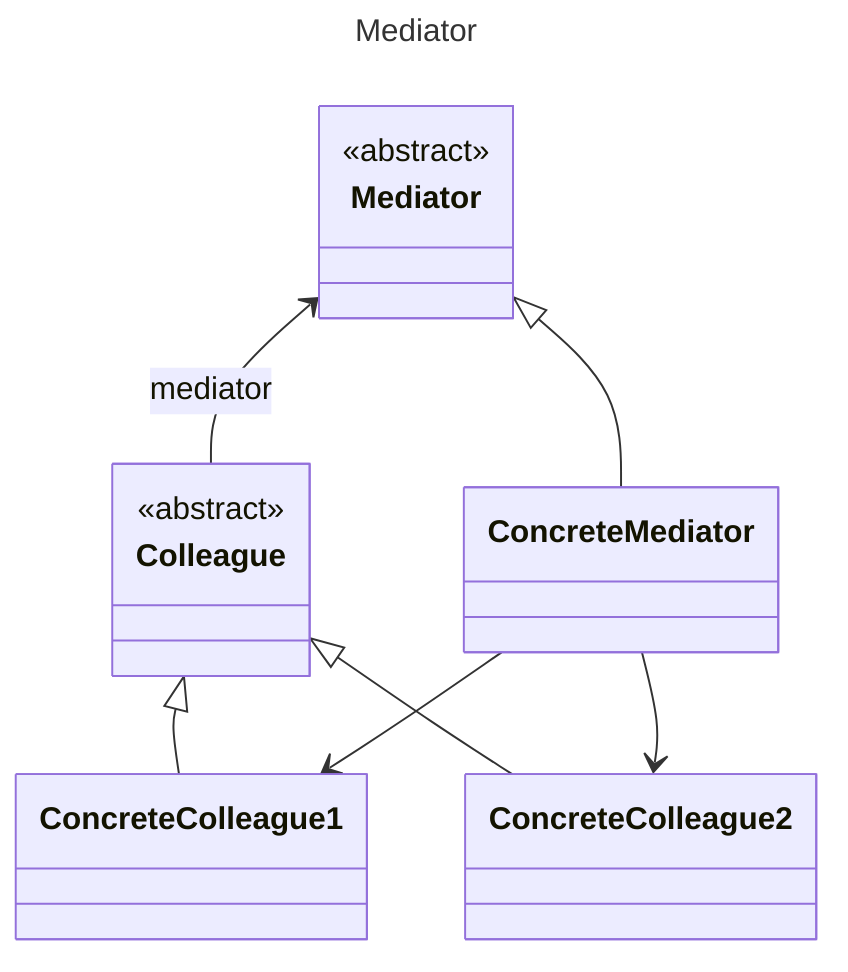
```mermaid
---
title: Mediator
---
classDiagram
    class Mediator {
        <<abstract>>
    }
    
    Mediator <|-- ConcreteMediator
    
    class Colleague {
        <<abstract>>
    }
    
    Colleague <|-- ConcreteColleague1
    Colleague <|-- ConcreteColleague2

    Mediator <-- Colleague : mediator

    ConcreteMediator --> ConcreteColleague1
    ConcreteMediator --> ConcreteColleague2
```

#### 5.1 When to use the Mediator Pattern
* A set of objects communicate in well-defined but complex ways. The resulting interdependencies are unstructured and difficult
to understand.
* Reusing an object is difficult because it refers to and communicates with many other objects.
Java Design Patterns 54 / 173
* A behavior that’s distributed between several classes should be customizable without a lot of sub-classing

### 6. Memento <a name="Memento"></a>
capture & restore an object's internal stats.

This is required when implementing checkpoints and "undo"
mechanisms that let users back out of tentative operations or recover from errors.

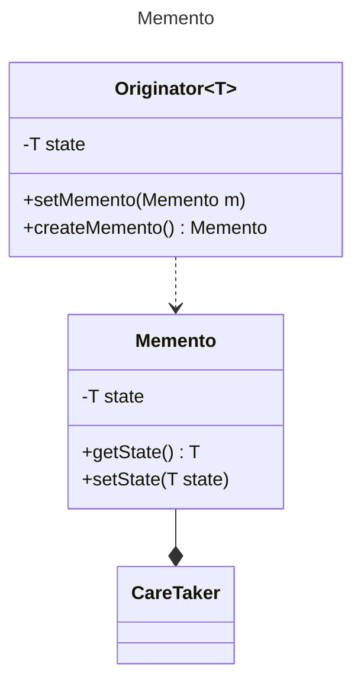
```mermaid
---
title: Memento
---
classDiagram
    class Originator~T~ {
        -T state
        +setMemento(Memento m)
        +createMemento() Memento
    }
    
    Originator ..> Memento
    
    class Memento~T~ {
        -T state
        +getState() T
        +setState(T state)
    }
    
    Memento --* CareTaker
```

### 7. Observer <a name="Observer"></a>
a way of notifying change to a group of objects.
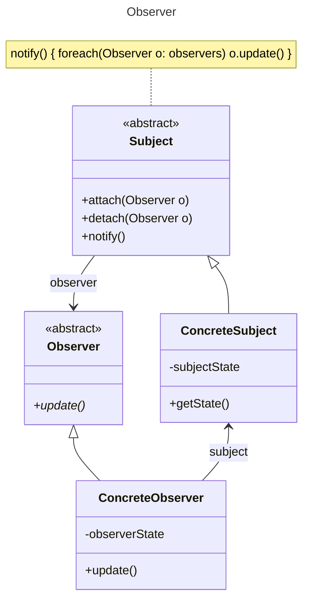
```mermaid
---
title: Observer
---
classDiagram
    note for Subject "notify() { foreach(Observer o: observers) o.update() }"
    class Subject {
        <<abstract>>
        +attach(Observer o)
        +detach(Observer o)
        +notify()
    }
    
    Subject <|-- ConcreteSubject
    class ConcreteSubject {
        -subjectState
        +getState()
    }
    
    class Observer {
        <<abstract>>
        +update()*
    }
    
    Observer <|-- ConcreteObserver
    class ConcreteObserver {
        -observerState
        +update()
    }
    
    Subject --> Observer : observer
    ConcreteSubject <-- ConcreteObserver : subject
```

### 8. State <a name="State"></a>
alter an object's behavior when its state change.
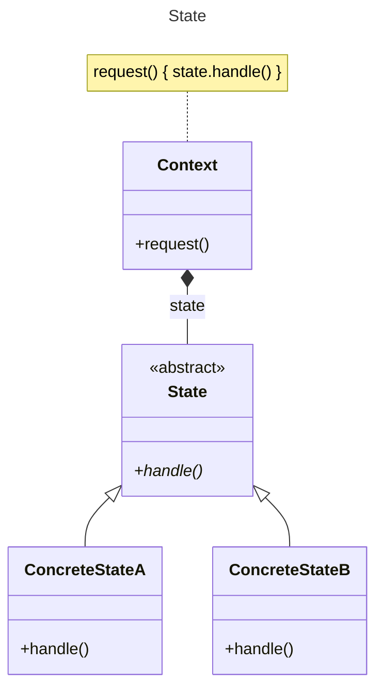
```mermaid
---
title: State
---
classDiagram
    note for Context "request() { state.handle() }"
    class Context {
        +request()
    }
    
    Context *-- State : state
    class State {
        <<abstract>>
        +handle()*
    }
    
    State <|-- ConcreteStateA
    ConcreteStateA: +handle()
    
    State <|-- ConcreteStateB
    ConcreteStateB: +handle()
```

### 9. Strategy <a name="Strategy"></a>
encapsulate an algorithm to a subclass.
```mermaid
---
title: Strategy
---
classDiagram
    class Context {
        +contextInterface()
    }
    
    Context *-- Strategy : strategy
    class Strategy {
        <<abstract>>
        +algorithmInterface()*
    }
    
    Strategy <|-- ConcreteStrategyA
    ConcreteStrategyA: +algorithmInterface()
    
    Strategy <|-- ConcreteStrategyB
    ConcreteStrategyB: +algorithmInterface()

    Strategy <|-- ConcreteStrategyC
    ConcreteStrategyC: +algorithmInterface()
```

#### 9.1 When to use the Strategy Design Pattern
* Many related classes differ only in their behavior. Strategies provide a way to configure a class with one of many behaviors.
* You need different variants of an algorithm. For example, you might define algorithms reflecting different space/time trade-offs.
Strategies can be used when these variants are implemented as a class hierarchy of algorithms.
* An algorithm uses data that clients shouldn’t know about. Use the Strategy pattern to avoid exposing complex, algorithmspecific data structures.
* A class defines many behaviors, and these appear as multiple conditional statements in its operations. Instead of many conditionals, move related conditional branches into their own Strategy class.

### 10. Template Method <a name="TemplateMethod"></a>
defer the exact steps of an algorithm to a subclass.
```mermaid
---
title: Template Method
---
classDiagram
    note for AbstractClass "templateMethod() { primitiveOperation1(); primitiveOperation2(); }"
    class AbstractClass {
        <<abstract>>
        +templateMethod()
        +primitiveOperation1()*
        +primitiveOperation2()*
    }
    
    AbstractClass <|-- ConcreteClass1
    class ConcreteClass1 {
      +primitiveOperation1()
      +primitiveOperation2()
    }
    
    AbstractClass <|-- ConcreteClass2
    class ConcreteClass2 {
      +primitiveOperation1()
      +primitiveOperation2()
    }
```

#### 10.1 When to use the Template Design Pattern
* To implement the invariant parts of an algorithm once and leave it up to subclasses to implement the behavior that can vary.
* When common behavior among subclasses should be factored and localized in a common class to avoid code duplication. You
first identify the differences in the existing code and then separate the differences into new operations. Finally, you replace the
differing code with a template method that calls one of these new operations.
* To control subclasses extensions. You can define a template method that calls "hook" operations (see Consequences) at specific
points, thereby permitting extensions only at those points.

#### 10.2Template Pattern in JDK
* java.util.Collections#sort()
* java.io.InputStream#skip()
* java.io.InputStream#read()
* java.util.AbstractList#indexOf()

### 11. Visitor <a name="Visitor"></a>
defines a new operator to a class without change.
```mermaid
---
title: Visitor
---
classDiagram
    class Visitor {
        <<abstract>>
        +visitConcreteElementA(ConcreteElementA element)*
        +visitConcreteElementB(ConcreteElementB element)*
    }
    
    Visitor <|-- ConcreteVisitorA
    class ConcreteVisitorA {
      +visitConcreteElementA(ConcreteElementA element)
      +visitConcreteElementB(ConcreteElementB element)
    }

    Visitor <|-- ConcreteVisitorB
    class ConcreteVisitorB {
      +visitConcreteElementA(ConcreteElementA element)
      +visitConcreteElementB(ConcreteElementB element)
    }
    
    ObjectStructure --> Element
    class Element {
        <<abstract>>
        +accept(Visitor visitor)*
    }
    
    Element <|-- ConcreteElementA
    note for ConcreteElementA "accept(Visitor visitor) { visitor.visitConcreteElementA(this) }"
    class ConcreteElementA {
        +accept(Visitor visitor)
        +operationA()
    }

    Element <|-- ConcreteElementB
    note for ConcreteElementB "accept(Visitor visitor) { visitor.visitConcreteElementB(this) }"
    class ConcreteElementB {
      +accept(Visitor visitor)
      +operationB()
    }
    
    Client --> Visitor
    Client --> ObjectStructure
```

#### 11.1 When to use the Visitor Design Pattern
Use the Visitor pattern when:
* An object structure contains many classes of objects with differing interfaces, and you want to perform operations on these
objects that depend on their concrete classes.
* Many distinct and unrelated operations need to be performed on objects in an object structure, and you want to avoid "polluting"
their classes with these operations. Visitor lets you keep related operations together by defining them in one class. When the
object structure is shared by many applications, use Visitor to put operations in just those applications that need them.
* The classes defining the object structure rarely change, but you often want to define new operations over the structure. Changing
the object structure classes requires redefining the interface to all visitors, which is potentially costly. If the object structure
classes change often, then it’s probably better to define the operations in those classes.

#### 11.2 Visitor Design Pattern in JDK
* javax.lang.model.element.Element and javax.lang.model.element.ElementVisitor
* javax.lang.model.type.TypeMirror and javax.lang.model.type.TypeVisitor